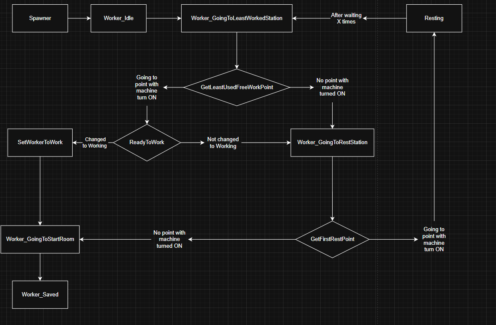

# Worker–Machine Interaction Flow

This document describes how `MachineWorkerManager` reacts to machine state changes and directs workers.

## Sequence
1. **Subscribe**
   - `MachineWorkerManager.SubscribeToMachineEvents` registers to every `FactoryMachine.OnMachineStateChanged` event.
2. **Machine Turns Off**
   - `HandleMachineStateChanged` calls `OnMachineTurnedOff`.
   - The currently connected worker (`FactoryMachine.CurrentWorker`) is retrieved.
   - If the machine is a `RestStation`, `AssignToStartRoom` sends the worker to the start room center.
   - Otherwise `AssignToRestPoint` selects the nearest free rest waypoint via `WaypointService.GetFirstRestPoint`.
   - The worker's activity state is updated to `Resting` or will become `Saved` upon arrival.
3. **Machine Turns On**
   - `HandleMachineStateChanged` calls `OnMachineTurnedOn`.
   - Workers stored in `waitingWorkers` for this machine are notified and set back to `Active`.
   - They may resume work on the machine (example pseudocode in code comments).

## Target Selection
- Rest points come from `WaypointService.GetFirstRestPoint`. When none are free, workers fall back to the start room via `AssignToStartRoom`.
- The start room center is provided by `FactoryManager.GetStartCellWorldPosition` and converted to a waypoint using `WaypointService.GetClosestWaypoint`.

## State Updates
- `SetWorkerState` is a wrapper around `EnemyWorkerController.SetWorkerState` which updates the `WorkerCondition` enum (`Active`, `Resting`, `Saved`).
- `Worker_GoingToStartRoom` switches to `Worker_Saved` once the worker reaches the start room, which triggers the global `RobotSaved` notification.

## Edge Cases
- **No free rest points**: `AssignToRestPoint` automatically calls `AssignToStartRoom`.
- **Simultaneous machine toggles**: each event is processed individually; `waitingWorkers` tracks workers per machine so multiple toggles are handled gracefully.

## Schema 

